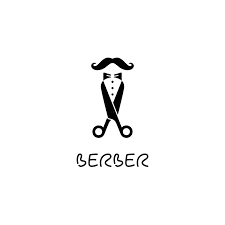
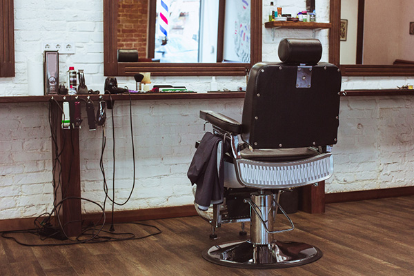

#  Barber - Randevu Otomasyon Sistemi

<div align="center">
  
  <br><br>
  
  
  
  
  
</div>

<br>

## 📖 Proje Hakkında
**Gentlemen's Barber Shop**, modern web teknolojileri kullanılarak geliştirilmiş dinamik bir randevu ve yönetim sistemidir. Müşterilerin şube seçimi yaparak, diledikleri tarih ve saat için kolayca randevu alabilmelerini sağlar.

Proje, **Single Page Application (SPA)** hissi veren AJAX yapısı ve güvenli **PDO** veritabanı bağlantısı ile hem hızlı hem de güvenli bir kullanıcı deneyimi sunar.

## ✨ Öne Çıkan Özellikler

* **⚡ AJAX ile Kesintisiz Deneyim:** Randevu formu gönderildiğinde sayfa yenilenmez, kullanıcıya anlık bildirim (Success/Error mesajları) gösterilir.
* **🔒 Güvenli Veritabanı Mimarisi:** PHP PDO (PHP Data Objects) kullanılarak SQL Injection saldırılarına karşı tam koruma sağlanmıştır.
* **📱 Responsive Tasarım:** Bootstrap 5 ile geliştirilen arayüz, mobil, tablet ve masaüstü cihazlarda kusursuz çalışır.
* **✅ Regex Validasyon:** Telefon numaraları `5xxxxxxxxx` formatında otomatik olarak temizlenir ve doğrulanır. Hatalı girişler sunucu tarafında engellenir.
* **📂 Modüler Yapı:** Veritabanı bağlantısı (`db.php`) ve işlem dosyaları (`booking.php`) ayrılarak kodun okunabilirliği artırılmıştır.

## 🛠️ Kullanılan Teknolojiler

| Alan | Teknoloji | Açıklama |
| :--- | :--- | :--- |
| **Backend** | PHP | Sunucu taraflı işlemler ve mantıksal kontroller. |
| **Veritabanı** | MySQL | Müşteri ve randevu kayıtlarının tutulması. |
| **Frontend** | HTML5 & CSS3 | Sayfa iskeleti ve özel stiller (`Unbounded` fontu). |
| **Framework** | Bootstrap 5 | Responsive grid yapısı ve bileşenler. |
| **Scripting** | JavaScript (AJAX) | Asenkron veri transferi ve DOM manipülasyonu. |

## 🚀 Kurulum Adımları

Projeyi kendi bilgisayarınızda (localhost) çalıştırmak için şu adımları izleyin:

1.  **Projeyi Klonlayın:**
    ```bash
    git clone [https://github.com/KULLANICI_ADINIZ/REPO_ADINIZ.git](https://github.com/KULLANICI_ADINIZ/REPO_ADINIZ.git)
    ```

2.  **Veritabanını Oluşturun:**
    * phpMyAdmin veya MySQL Workbench açın.
    * `barber_db` adında bir veritabanı oluşturun.
    * Aşağıdaki SQL kodunu çalıştırarak tabloyu oluşturun:

    ```sql
    CREATE TABLE randevular (
        id INT AUTO_INCREMENT PRIMARY KEY,
        ad_soyad VARCHAR(100) NOT NULL,
        telefon VARCHAR(15) NOT NULL,
        randevu_saati VARCHAR(10) NOT NULL,
        sube VARCHAR(50) NOT NULL,
        randevu_tarihi DATE NOT NULL,
        kisi_sayisi INT DEFAULT 1,
        mesaj TEXT,
        olusturulma_tarihi TIMESTAMP DEFAULT CURRENT_TIMESTAMP
    );
    ```

3.  **Veritabanı Ayarlarını Yapın:**
    * `db.php` dosyasını açın ve kendi yerel sunucu bilgilerinizi girin:
    ```php
    $username = 'root'; // Genellikle root
    $password = '';     // Şifreniz (varsa)
    ```

4.  **Çalıştırın:**
    * XAMPP veya WAMP sunucunuzu başlatın.
    * Tarayıcıda `http://localhost/proje-klasoru` adresine gidin.

## 📸 Ekran Görüntüleri

| Ana Sayfa | Randevu Formu |
| :---: | :---: |
|  |  |

## 📞 İletişim

Geliştirici: **[Adınız Soyadınız]** E-posta: [mail@adresiniz.com]  
LinkedIn: [linkedin-profiliniz]

---
*Bu proje eğitim amaçlı geliştirilmiştir.*
